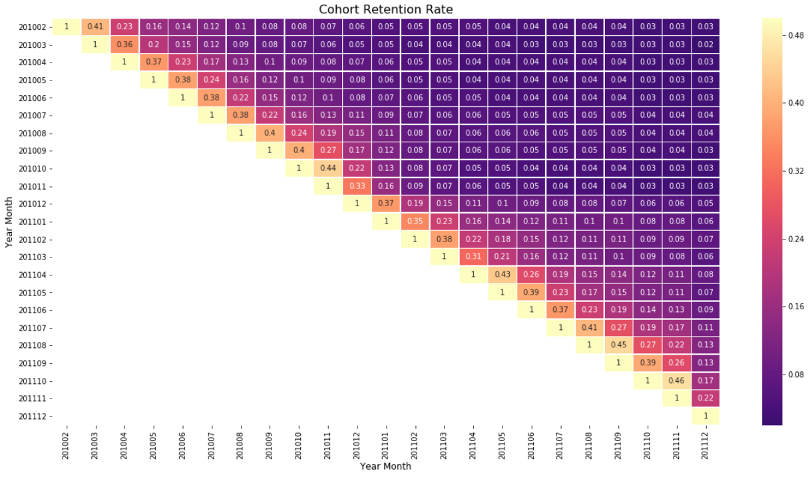
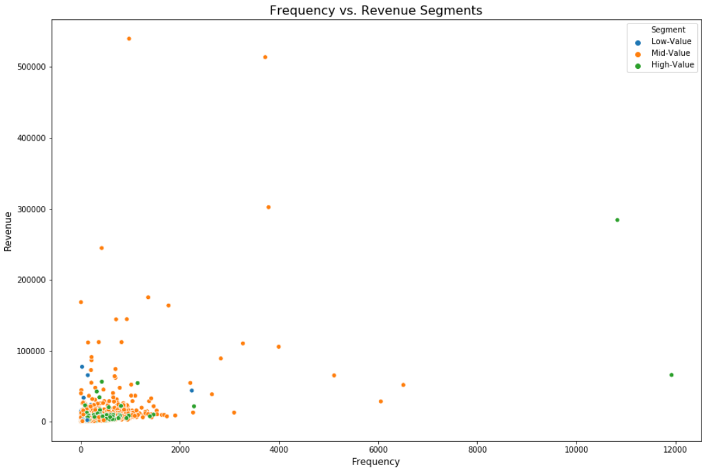
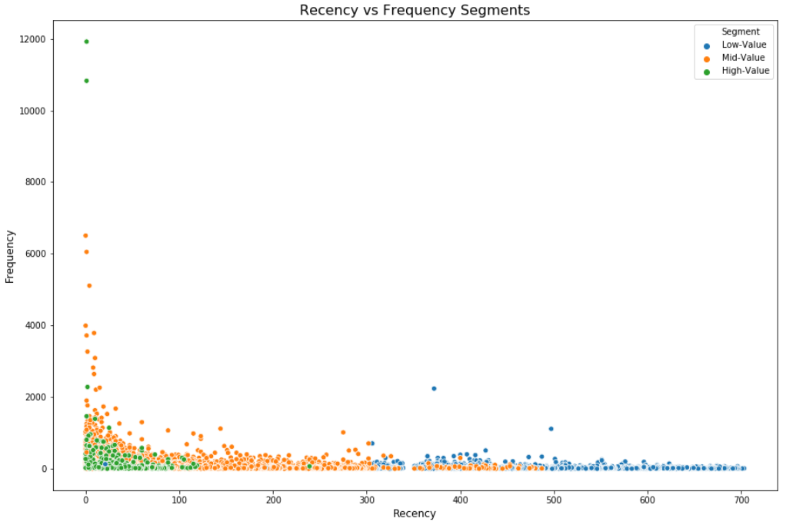
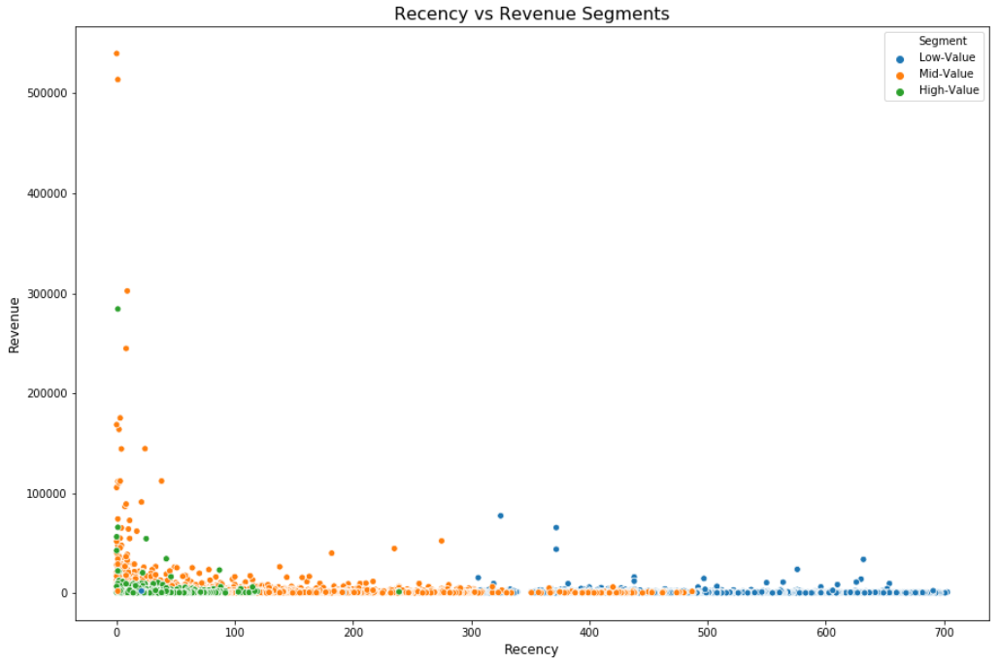
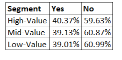

# Retail Customer Analysis
This report is an analysis of the [Online Retail II Dataset found on the University of California Irvine Machine Learning Repository](http://archive.ics.uci.edu/ml/datasets/Online+Retail+II) in order analyze the current state of the business, how they are retaining their customers and clustering them into High-Value, Mid-Value, and Low-Value categories in order to improve marketing efforts.  

A **classification model** was created to predict in the future if a customer will be High-Value, Mid-Value, or Low-Value. 

The **hypothesis** that we will be testing will be to analyze if certain products are being purchased by certain customer groups. For example, High-Value customers are purchasing certain products that can be then marketed to Mid-Value and Low-Value customers to increase the revenue.

**Null Hypothesis**: Product purchased (description) has no influence on customer groups. 

**Alternate Hypothesis**: Product purchased (description) does influence customer groups. 

**Interest in The Dataset**:  
Personally, I am interested retail businesses and in customer behavior. I believe marketing efforts can be improved in many organizations by marketing to the right customers and to provide value to them based on their needs. 

**Context on The Data**:  
The dataset consists of transactional data with customers in 41 different countries who make purchases from an online retail company based in the United Kingdom (UK) that sells unique all-occasion gifts.

## Results

### Cohort Retention Rate 
A cohort retention heatmap was created to find how the Online Retailer is retaining their customers. In the following heatmap each month is considered a cohort.

### Recency-Frequency-Monetary (RFM) Analysis
An RFM analysis was completed to better understand and score the customers into High-Value, Mid-Value, and Low-Value customers. 
K-Mean clustering was used in identifying the customer clusters.
#### Frequency vs. Revenue

In the plot above we can view the Online Retailer’s High-Value customers are frequent and make smaller purchases. 

#### Recency vs. Frequency

In the plot above we see that the High-Value customers visit frequently, and their visits have been recent. 
#### Recency vs. Revenue

In the plot above we can see our High-Value customers have visited recently and are making smaller purchases.  

## Feature Extraction Product Relevance

The top 10 features in the **Description** attribute was extracted to view if they were contained in the High-Value, Mid-Value, or Low-Value customer orders. 

From this analysis we can conclude that by a small degree our High-Value customers do purchase products in our top features to a higher degree than our Mid-Value and Low-Value customers, but it is not significant enough of a value to provide to the marketing team.

## Conclusion

In conclusion we have identified the following: 
- The Online Retailer should be focusing more on retention and providing better service to their higher value customers. This can now be completed more efficiently and effectively with newly formed customer segments groups. 
- We have created a Random Forrest Classifier with a high accuracy, precision, and recall predicting future customer segment. It is important to investigate further why the accuracy is so high in this model. Currently, I believe it is due to the imbalance of the customer clusters and it requires further hyperparameter tuning
- Currently, our findings do not show a high enough percentage of users that do purchase our products extracted from our features in our model. That would mean that we fail to reject our null hypothesis.  

## Google Colab 

View the following [link](https://colab.research.google.com/github/nimaaref/RetailCustomerAnalysis/blob/master/OnlineRetailAnalysis_Nima-Aref.ipynb) to collaborate! 

## License 

This project is licensed under the MIT License - see the [LICENSE.md](LICENSE) file for details
